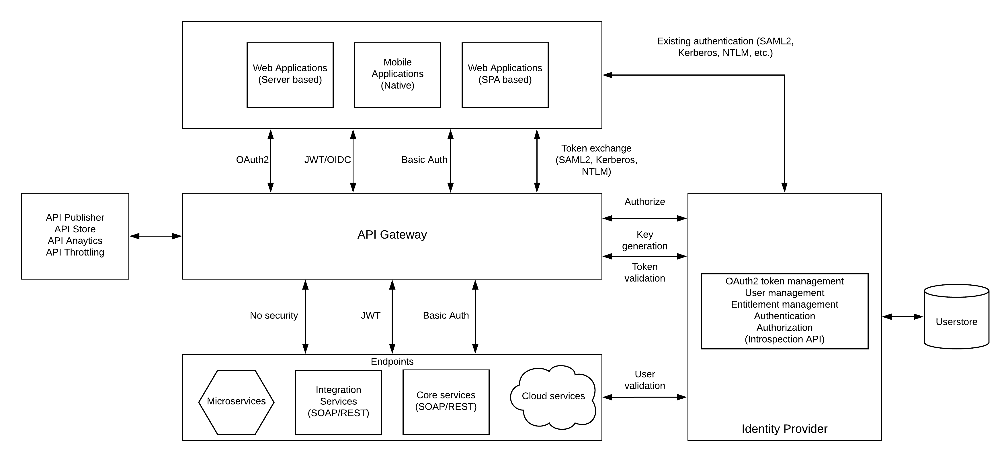

## API Security Pattern

### Introduction

APIs are the interface to external and internal users through which valuable business information is shared. Protecting these valuable information access is crucial in enterprise software design. 

APIs provides you with the ability to compete in the digital marketplaces where brick and mortar stors are no longer dominating. The entire consumer and business landscape is becoming more and more digital savvy and it is essential for any enterprise regardless of their domain, to blend into this digital transformation. Companies from manufacturing, healthcare, automobile to consumer electronics are some of the examples which were not relying on digital business in the past but rapidly moving through digital journeys. 

The market has become so big that a product you make in some rural village in SriLanka can be sold to an individual who is living in New York through the online digital e-commerce website like ebay or alibaba. Rather than going into a retail or wholesale shop, people would like to order items from their fingertips by using a mobile phone or a tablet. Enterprises has been doing well without these mobile apps and websites for a longest of time in the past. But that time is over. 

Now enterprises are reqiured to offer their business services through different channels to their internal and external consumers. Those different consumers will use different mediums to access your business information. Having a set of well defined, well documented, browsable set of APIs would allow these different users to consume these business information with all sorts of different mediums. Some of the mediums are

- Mobile application
- Web application (server based)
- Web sites (Single Page Application based)

### Protecting your APIs

Allowing users to access your business information helps you to expand your business and compete with the other vendors. But due to the competition and the nature of the internet, you cannot expose your valuable business information without any security and control. If you don't control your APIs, there are hackers who will jeopardize your business even before you think about it by various means. 

API Security is an evolving concept which has been there for less than a decade. When it comes to securing your APIs, there are 2 main factors. 

- Authentication - Identifying and validating the user identity (who you are)
- Authorization - Recognizing the level of access a user has to the business information (what you can do)

User authentication is the basic requirement of providing access to any system. That method has been there for a longest of time since the beginning of computers. In the past you could have keep your user names and password in some vault and use them to authenticate into the systems you want to access. With the growth of different business systems and the other web applications you access day to day, sometimes keeping all these usernames and passwords has become a difficult task. Most people uses same credentials for their bank accounts, social logins, computer logins as well as business applications. So providing this information to one system can be dangerous if some hackers access this information (Facebook recently found out that they have stored user credentials in plain-text in their databases). 
