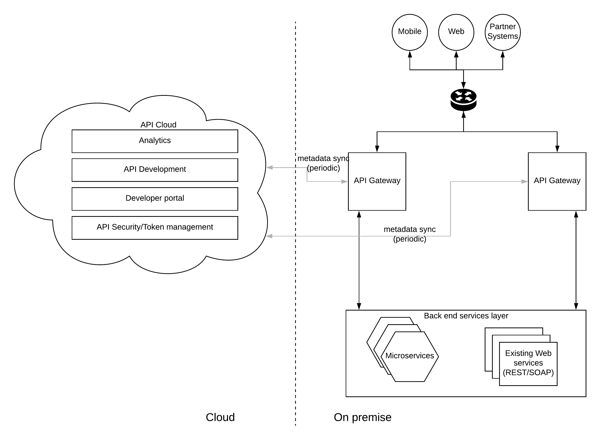

## Hybrid API Management Pattern

### Introduction
API Management has become a cornerstone in any digital transformation project happening within the enterprise world. APIs provide a mechanism to build a secured, well-defined, discoverable interface to external consumers who are coming through various channels. API Management platforms provide a set of functionalities which are required by your business services. 

- Security (Authn and Authz)
- Monitoring & Analytics
- Throttling & Rate limiting
- Discoverability
- Error handling

### Deployment choices
The functional capabilities mentioned above can be run independently if the API Management vendor has designed the solution in such a manner. These functional components can run within different runtimes and different environments while communicating with each other to provide the end to end API management functionality. 

The APIM platforms which are implemented in a modularized nature can be deployed in a hybrid architecture as depicted in the below figure.

Enterprises are more and more moving towards cloud based infrastructure and having a fully managed software solution is preferred over on-premise software due to the ease of management. But it is not possible to go with full cloud solutions which are offered as SaaS solutions due to various regulatory requirements. In such a scenario, enterprises can use this hybrid api management pattern. In this model, API management functional components are deployed in 2 different environments. 

1. API Gateway is deployed in on-premise infrastructure
2. API Management, Analaytics, Security components are deployed in cloud infrastructure

### Advantages of hybrid model 
