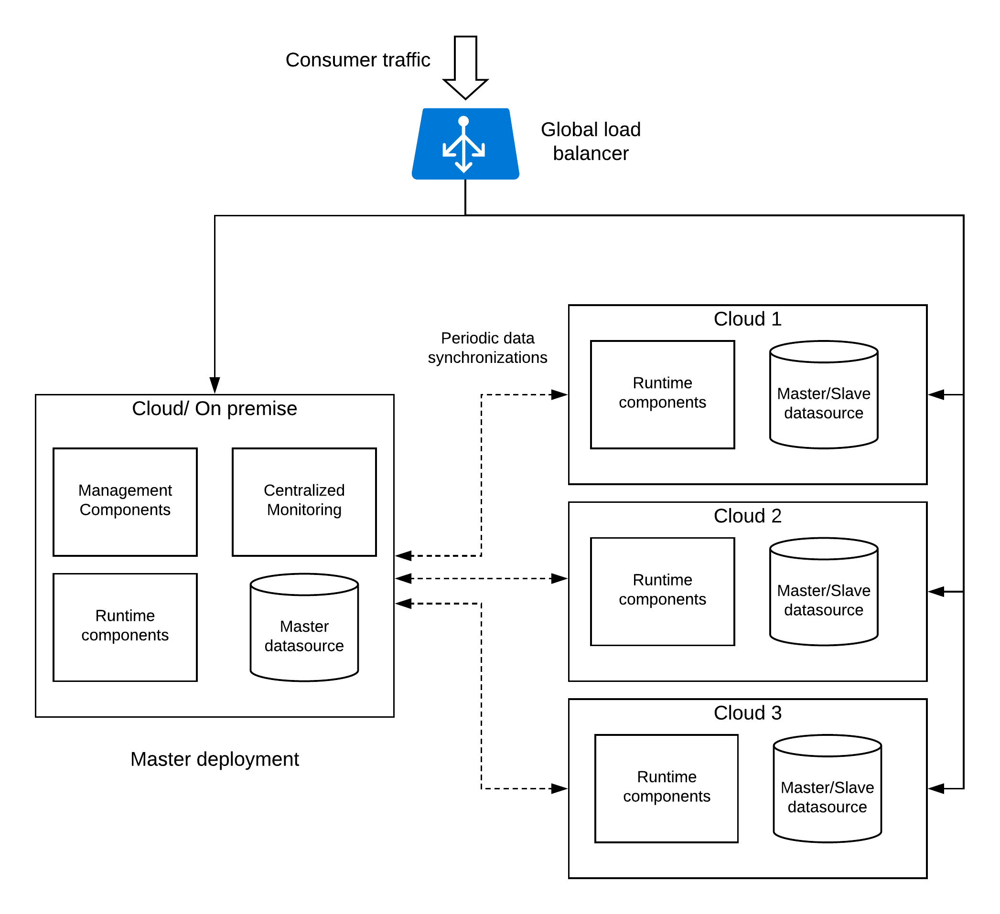
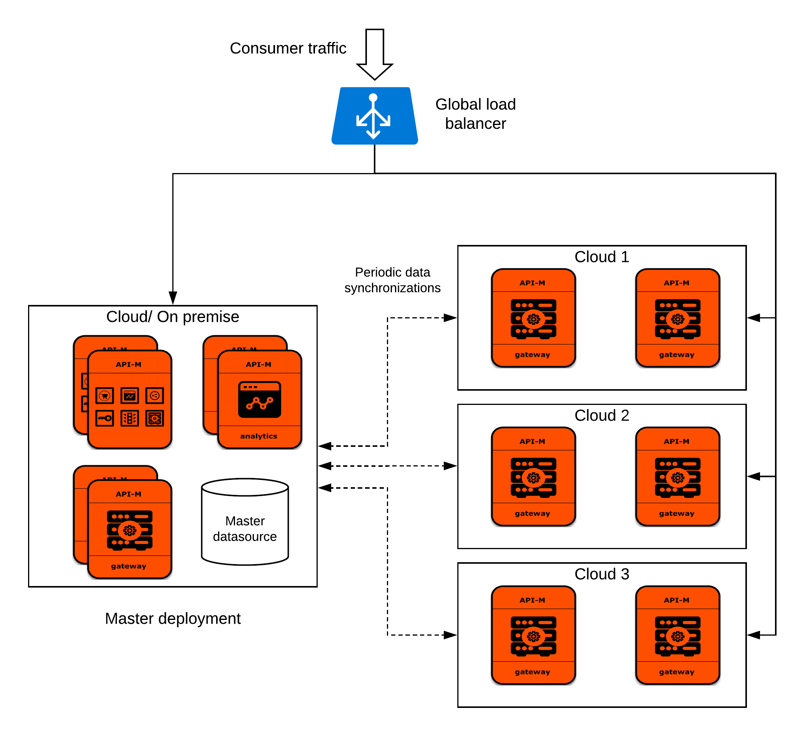

# Multi Cloud Enterprise Deployment Pattern

## Introduction
Enterprises are expanding their IT operations to match with the consumer demand and to become the leader in their respective industries. Cloud has provided a reliable platform to these enterprises to run their business operations without much hassle. Few years ago, Amazon Web Services or AWS was the only choice people had when they want to deploy their applications in a cloud environment. But the market has been changed and there are many other vendors who offers cloud infrastructure at a competitive price. This allowed the enterprises to choose the best cloud environment for a given task rather than locking into a single vendor. 

### Advantages
Instead of running all your business functionality in a single cloud or on-premise platform, running on multiple clouds give enterprises many advantages. Here are few advantages.

- Provides much better service availability - Given that your applications are running across mutiple cloud environments, your services can run without much interruption even if an entire cloud system goes down. 

- Get enterprises free from vendor lock-in - Cloud vendors always try to get as much applications into their own cloud and that will lock you into a single vendor so that you cannot get away from them even you need to do it. With the multi-cloud approach, you don't need to lock into any vendor and move away from them at any time. 

- Can negotiate for better deals - Once you are in multi cloud, you have more power to demand for discounts since every vendor wants to increase their share of your account. 

- Can use best technology for the applications - Different cloud vendors are strong in different areas. When you have a multi cloud strategy, you can select the best technology for your task which is provided by the resective cloud vendor.

- Can provide better performance to consumers - Your applications can run on multiple clouds and expose the functionality through cloud gateways which are closed to the consumers in relevant cloud deployments based on locations.

## Architecture
Maintaining a multi cloud deployment is not a trivial task. You need to architect the deployment such that it is maintainable. Otherwise you will lose the purpose of setting up the multi cloud stretegy in the first place. Given below is a high level solutions architecture on how you can deploy your applications within a multi cloud environment.

As depicted in the above figure, it is best to have a master deployment which acts as the leader of the overall deployment. This master deployment can be hosted on-premise or in a cloud infrastructure. In this master deployment, you should have the components like

- Management components which are used to add/modify artefacts to runtimes
- Analytics and monitoring components which are capable of monitoring across multiple clouds
- Master datasources which acts as master in a master/slave or master/master (multi-master) deployment
- Runtime components which serves the traffic from consumers

In addition to this master deployment, there can be multiple of worker deployments which contains

- Runtime components which served the traffic from customers
- Master/Slave data sources which contains runtime and metadata which are required by the applications

The above architecture explains at a high level which type of components can run on which parts of the deployment. Let's understand this better with a reference architecture where WSO2 API Manager is deployed in a multi cloud deployment architecture. 

As depicted in the above figure, management components of the WSO2 API Manager are deployed in the master deployment. This can be a deployment on an on-premise DC, private cloud or a public (shared) cloud. The components in the master deployment are

- API Publisher
- API Store
- API Analytics
- API Key Manager
- API Gateway

Additionally, you can have worker deployments across different cloud environments which contains the APIM Gateway component. 

## Usage Patterns
Multi cloud deployment architecture can be used for different use cases. Here are some of the usage patterns.

- Run production on master and pre-production on worker deployments
- Run production on both master and worker deployments for load balancing, high availability and better performance
- Run bursts in worker clouds while running main production load in master cloud
- Run DR site on worker cloud while running production in master
- Run workloads across clouds based on the load and the cheapest pricing option (cloud arbitrage)

## Conclusion
Multi-cloud strategy is something every enterprise is looking into because of the advantages it brings around the availability, pricing and vendor-locking.
