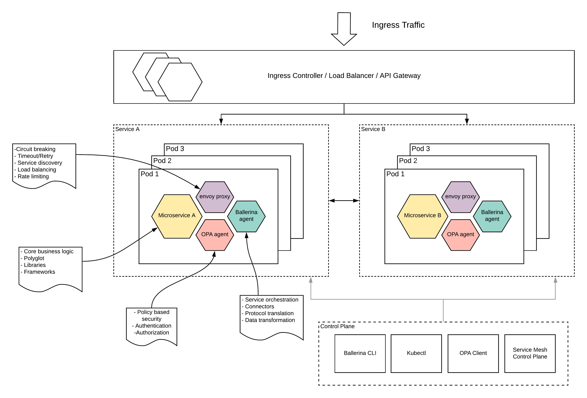

## Ballerina sidecar pattern for microservices

### Evolution of sidecar pattern
The microservices architecture pattern is designed to be distributed in nature. But recently, we have observed that this distribution of responsibility has gone beyond the microservices itself.

#### Sidecar 1.0 and the Service Mesh
The first sidecar pattern which became mainstream with microservices was the “Service Mesh” sidecar where certain functionalities related to network communication have been delegated into a separate sidecar. Some of the functionalities which were delegated are
- Error handling
- Load balancing
- Timeout/Retry
- Circuit breaker
- Service discovery
- Traffic routing/ Rate limiting

There are leading technologies that have become the front runners in the SM race. Some of them are
- Envoy/ Istio
- Nginx
- Linkerd

You can find a detailed article on service mesh sidecar pattern in the below github repository. The architecture is shown in below figure for reference.

#### Sidecar 2.0 and the OPA

Security is not an afterthought anymore. Microservices security is still at the early stages and people are trying out different approaches to provide security (authentication, authorization) for microservices which are written in polyglot fashion. The very first approach people tried for microservices security was to have a central component that provides authentication and authorization for microservices. This approach works without any issue. But the problem is that, it is more or less against the MSA strategy. Then people tried to use self-contained JWT for microservices security so that microservice itself can verify the tokens and make security-related decisions. Though this approach works fine and going along nicely with MSA, it has certain limitations on what level of security it can provide. That is where this Open Policy Agent (OPA) comes in handy where it provides a mechanism to delegate security-related functionality to an external agent (sidecar) which is running along with the microservice. OPA provides the ability to define policies with a language called REGO and the user and service-related data can be stored separately. You can find a detailed article on OPA can be used to secure microservices from the below link. The architecture presented in that article is shown below for reference.

### Ballerina sidecar pattern
With the above 2 approaches, it is evident that taking certain functionality out of the microservice and managing them separately proves the real power of the distributed nature of microservices. One fear people have with this sort of explosion of microservices into sidecars is the management overhead. With proper tools to manage and monitor microservices, it won’t be an issue.

Ballerina is a new programming language developed by a team at WSO2 with the focus of making application integration more powerful than ever before. I won’t say that it will make it easier. Rather I would say Ballerina is trying to give more power to the typical integration developer who used to work with restricted, high-level languages. Having said that, if we come back to the world of microservices, there are certain functionalities that we implement in microservices (business logic) that can be taken outside and do with a common library or framework. That is why people are using certain frameworks like Spring, Gson, Netty to do certain operations within microservices. If you do a thorough analysis of your microservices code, you will find that there are certain code segments that we write in almost all the microservices. That is where this concept of Ballerina sidecar plays a major role. Here are some of the requirements which we are using libraries/frameworks to implement.

- Handling of message types like JSON, XML, CSV, etc
- Transforming messages across formats
- Connecting with databases (CRUD operations)
- Integrating with other systems (SaaS, COTS)
- Doing protocol translations

Instead of bringing third-party libraries into our core microservice, we can implement these functionalities as a separate sidecar and expose them over an efficient protocol (HTTP/2, gRPC) would make life easier and more manageable for developers. If they need to make a change to their data transformation, they can do that without modifying the core microservice. All the microservice advantages will be there with this approach. Let’s take a look at how this would work at a high level.

As you can see in the above figure, there will be a “ballerina agent” which will run as a sidecar along with the main microservice. It will provide the capabilities which were mentioned above to the main microservice. Ballerina agent can have its own control plane with ballerina CLI to make changes to the ballerina sidecar. 

### Conclusion
As a final conclusion, it is evident that microservices architecture is expanding beyond its initial architecture and things are becoming more and more distributed and delegated with their own control planes. At the end of the day, operations people will need a mechanism to consolidate all these activities and connect them when bad things happen to the system. There is another set of technologies built for managing higher-level groupings of microservices so that you don’t need to monitor the entire mesh with 1000s of services. Cellery is such an attempt to build a management layer for these sorts of complex architectures. I am finishing my article with a link to Cellery.

[Cellery](https://wso2-cellery.github.io)

