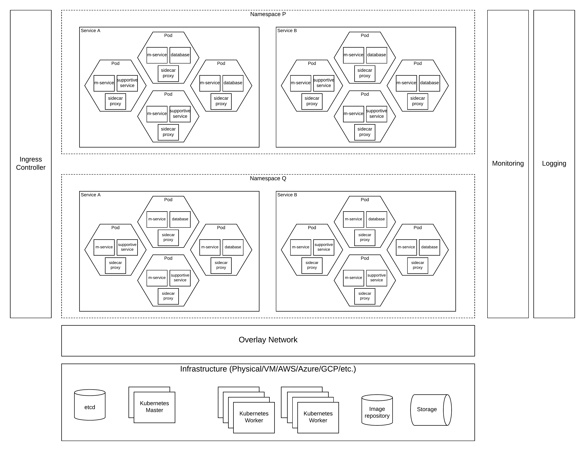

# Kubernetes Deployment Pattern

## Introduction
Container based deployments are becoming more and more popular within enterprise software architectures due to the many advantages it bring to the table. There are many articles which explains the advantages of containers vs virtual machines or physical machines. Running your application within a container does not solve all your problems. To reap the full benefits of a container based deployment, containers needs to be properly managed. Container orchestration platforms does just that. Kubernetes has become the defacto standard in container orchestration. It provides capabilities like

- Run work loads (applications) in containers
- Automated rollouts and rollbacks
- Service discovery and load balancing
- Self-healing and automatic scaling
- Storage Orchestration

In simple terms, kubernetes has provided an operating system to run your work loads (applications) within a data center by hiding the underlying complexity of the data center. Similar to running an application on your laptop or desktop, kubernetes provides a higher level interfaces to run your applications on containers. 

## Architecture
In kubernetes, there are few concepts which we need to understand before diving deep into the solutions architecture. 

#### Pod
Pod is the smallest unit of execution in kubernetes. It can run one or more containers and has its own ip address. 

#### Service
A service is a kubernetes component which can wrap one or more similar pods and expose a given functionality (service) to outside world. A service can expose more than one pod and load balance traffic between them. Service has its own IP address and port when accessing from external client. 

#### Ingress Controller
This provides an interface to external clients to access the services which are running within the kubernetes cluster. Typically, major load balaning vendors have implementations of this ingress controller.

#### Deployment
A deployment is a configuration which can create a given set of kubernetes artefacts like pods, services, replica sets, etc. 

#### Namespace
Namespaces are used to categorize different components which are related within kubernetes. As an example, different teams can utilize the same kubernetes cluster and run their own services by using their own namespaces without interfering with other teams.

As depicted in the above figure, 

- Individual work loads or applications can run within a pod as one or more containers. 
- Pod can contain the (micro)service, a support service (e.g. database), side car proxy (e.g. envoy) and other containers based on the requirement. 
- A single pod cannot cannot offer services to a scaling client requirements and grouping multiple pods into a service is the correct approach to take when deploying in kubernetes. 
- These services can expose the functionality of pods to external client through an ingress controller. 
- When designing these services, categorizing them based on the functionality into namespaces is recommended. 
- Once these namespaces are defined, the cluster wide resource allocations can be easily done. As an example, if a given set of services require more resources than the other services, you can enforce resource allocations at namespace level. 

## Under the hood
Kubernetes runs on top of an infrastructure layer. This can be any of the physical, virtual or cloud based resources. To set up a kubernetes cluster on a given infrastructure, you have to setup the relevant kubernetes components. 

#### Overlay network
Kubernetes has various components which acts like their own hosts with their own ip addresses, port ranges, and access with localhost interfaces. All these activities are controller by the overlay network implemented in kubernetes platform. It allows services within kubernetes to contact other services using their own ClusterIPs while routing external traffic from external IP addresses. 

#### Kubernetes master
These are the nodes which controls the state of the kubernetes cluster. It collects information from kubernetes workers and push commands to these workers to maintain the state.

#### Kubernetes worker
These are the nodes which runs the actual work loads in a container platform as pods, services. These workers get commands from manager to run the work loads.

#### etcd
Kubernetes uses etcd as the key value store to keep the metadata about the state of the kubernetes cluster. 

#### Image repository
Kubernetes runs containers using an image repository. This repository conatins the container images which contains the work load.

#### Storage
Containers are ephemeral in nature and they will come and go without keeping any state. But all the applications cannot survive without the state. To keep state across container restarts, kubernetes offers storage services.

Even though not directly related to core kubernetes functionalities, monitoring and logging plays a key role when managing a kubernetes environment. It provides visibility into the kubernetes cluster and it's operations. Having proper monitoring is a key when monitoring the application level details for debugging issues.

