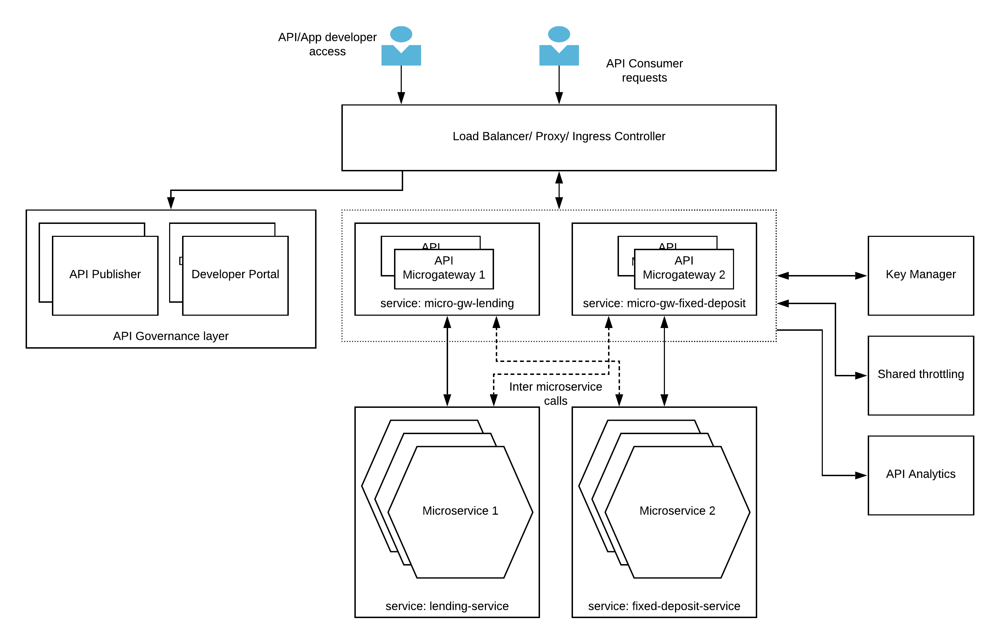

## Decentralized API gateway pattern

### Introduction
With the adoption of microservices style of architecture within the enterprise, decentralized api gateway pattern fits in nicely. Instead of having a centralized api gateway layer, each microservice can be fronted with an api gateway. WSO2 API microgateway can be deployed as a service (in kubernetes) which will provide the authentication, throttling, analytics, rate limiting capabilities to each microservice. 

### Architecture

As depicted in the above figure 1, In this deployment mode, api consumers can either use oauth2 tokens or jwt tokens. In the case of oauth2 tokens, microgateway will communicate with the key manager component. If there is a requirement to implement shared throttling across apis, microgateway will communicate with the external traffic manager. Analytics data will be published to the analytics runtime. In this deployment pattern, api publisher and store are deployed separately and will be exposed to api and application developers. These components will not have any interaction with microgateway components during the runtime. 
