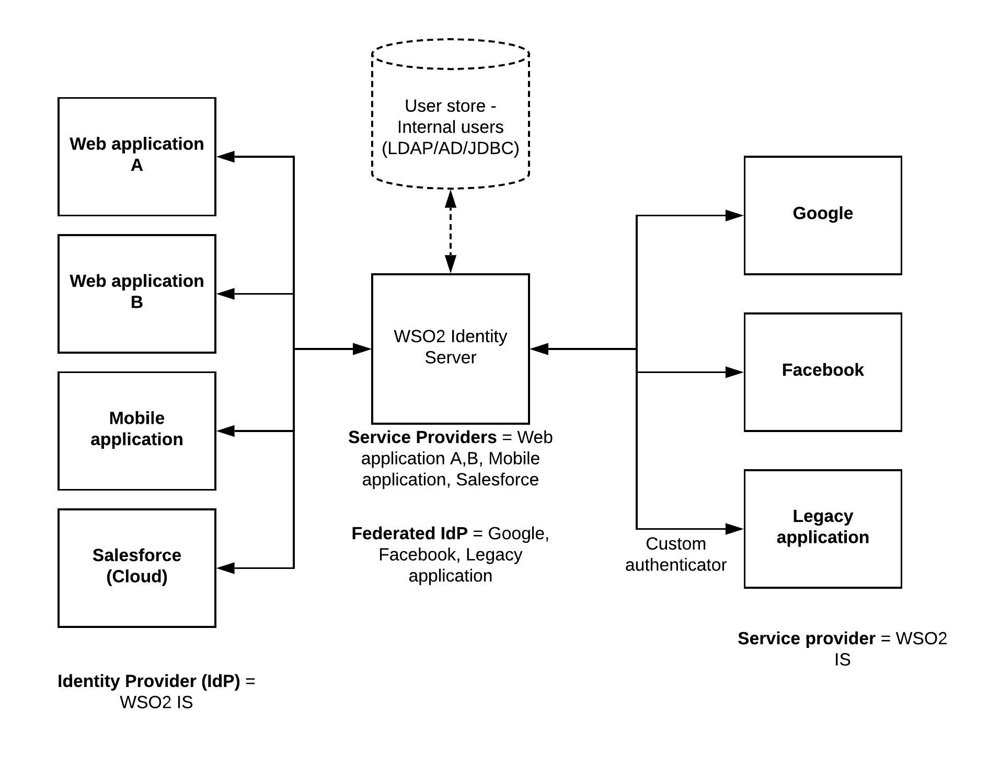

# Security Federation Pattern

## Introduction
Application security has been an area which has improved a lot with the time. Starting from the basic authentication, access control list(ACL), role based authentication, attribute based authentication, OAuth2, OIDC to JWT, it has evolved over the last decade or so. Enterprise applications typically has a long lifetime which spand across decades. If your enterprise has been there for few decades, there is a chance that you have variuos types of applications with different authentication mechanisms. In most cases, applications had their own user stores which were backed by a database and authenticated with username/password pair. 

This is not a scalable and maintainable solution due to the fact that users have to remember multiple username/password pairs and applications have their own user profiles and adding/removing/modifying these profiles is a tedious task. As a solution, solution architects can propose 2 approaches. 

1) Delegate the authentication to an Identity Provider and let it handle the security 
2) Federate the authentication to a 3rd party IdPs inclusing social logins 

Out of the above 2 options, we are discussing the second option in this pattern.

## Architecture
A typical enterprise software system consists of different types of applications like web, mobile and cloud based. Providing security to all these heterogenous systems requires a well designed Identity solution which is capable of understanding the protocols which are implemented by these systems. To enable federated authentication to these applications, this identity solution should understand the protocols supported by the outbound side as well. Here is the solutions architecture diagram of federated security pattern.

As depicted in the above figure, the applications on the far left corner are configured to identify WSO2 Identity Server as the Identity Provider (IdP). Then WSO2 IS is configured to consider these applications as service providers so that when a user tries to access any of these applications, user will be redirected towards WSO2 IS for authentication purpose. At the WSO2 IS side, 3rd party IdPs are configured as Federated Identity Providers (IdP). If this 3rd party system is a legacy application or an application which is not supported OOTB or through the connector store, users can write a custom outbound authenticator. 

## When to use
If you have heterogenous systems with user identities distributed across multiple Identity Providers or you need to enable social logins, you can consider this pattern rather than doing the authentication within the central IdP. 

## Advantages

- Users get easy access to multiple systems without remembering multiple passwords
- No need to keep copies of user information within the central identity system
- User management can be offloaded to external IdPs

